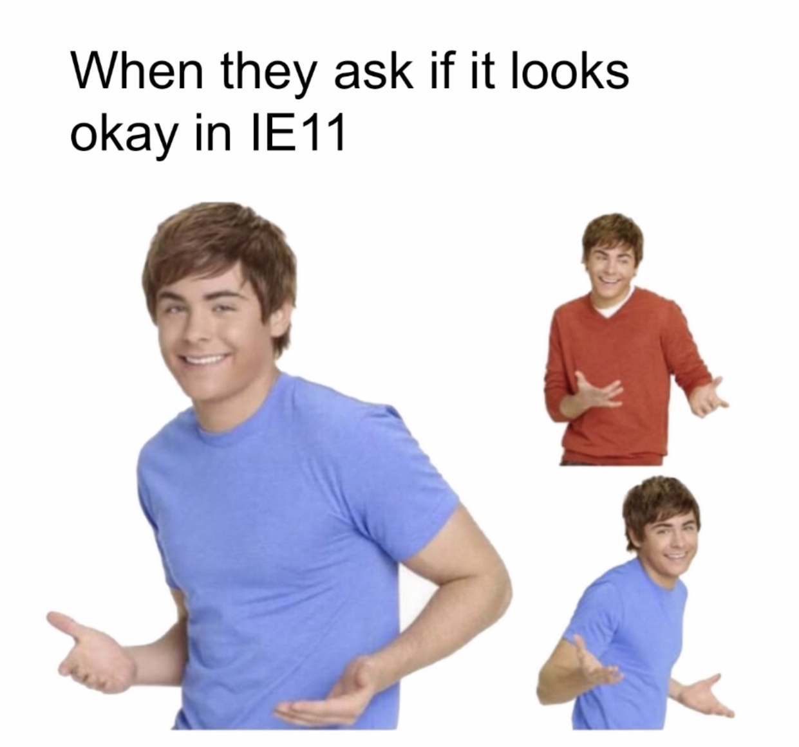
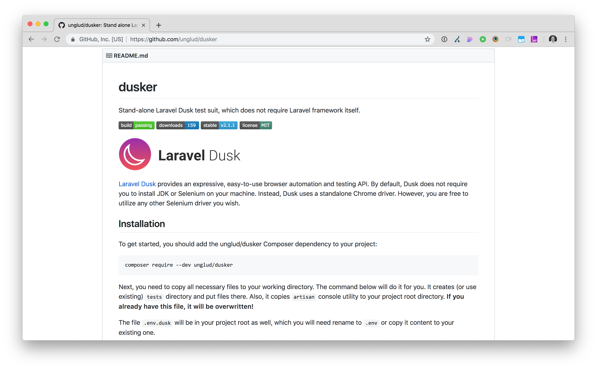

footer: Automated browser testing - David Darke | [atomicsmash.co.uk](https://www.atomicsmash.co.uk)
slidenumbers: true

# [fit] Automated
# [fit] browser testing 🤖

## By David Darke

---


---

# [fit] Current testing trends

- Everyone does some form of testing
- Testing results might not be logged anywhere
- Lots of testing happens when a project launches, but this may reduce as a site is rolled out

---

# A lot of testing might be around requirements or client questions:



---

# Standard browser testing is:
- Time consuming.
- VERY easy to forget to test something important.
- New developers on projects might not know what to test.
- Dev aren't lazy, but most of the time there is something more important they should be working on.

---

# [fit] WHY CAN'T WE
# [fit] AUTOMATE
# [fit] THIS?!?!

---

# [fit] You probably have heard
# [fit] of **unit testing**

---

# With Unit Testing you break down functionality into small chunks (units) and validate one bit at a time.

---

[.autoscale: true]

# For example...
# A fake subscription purchase

* User logs in
* User makes purchase
* Get subscription information from the order
* Assign subscription to user

---

[.autoscale: true]

* User logs in
    * *Get current user*
    * Validate
    * Log user into site
* User makes purchase
    * An order is created
    * Order emails are sent
* Get subscription information from the order
    * Check order for subscription product
    * Sign up emails might be sent
* Assign subscription to user
    * Check subscription was purchased
    * Add subscription to user
    * Check the subscription is active

---


---

# [fit] **Unit testing is great,**
# but simple browser testing give you realistic user experiences

---


---

## What does it actually do though?


---



---

# Install with 4 commands


https://github.com/unglud/dusker

---

Here is a very simple test. This looks for text on a screen

<br>

```php
public function testFindText()
{
    $this->browse(function (Browser $browser) {
        $browser->visit('/')
                ->assertSee('Text on Homepage');
    });
}
```

---

Here is a very simple test. This looks for text on screen

<br>

[.code-highlight: 1,2,3,6,7,8]


```php
public function testFindText()
{
    $this->browse(function (Browser $browser) {
        $browser->visit('/')
                ->assertSee('Text on Homepage');
    });
}
```

---

Here is a very simple test. This looks for text on screen

<br>

[.code-highlight: 4]


```php
public function testFindText()
{
    $this->browse(function (Browser $browser) {
        $browser->visit('/')
                ->assertSee('Text on Homepage');
    });
}
```

---

Here is a very simple test. This looks for text on screen

<br>

[.code-highlight: 5]


```php
public function testFindText()
{
    $this->browse(function (Browser $browser) {
        $browser->visit('/')
                ->assertSee('Text on Homepage');
    });
}
```

---

You can even fill out a form:

```php
public function testBasicForm()
{
    $this->browse(function (Browser $browser) {
        $browser->visit('/form-page/')
                ->type('name_field', 'Cool name')
                ->type('email_field', 'coolemail@gmail.com')
                ->press('Submit')
                ->waitForText('Thanks for contacting us!')
                ->assertSee('We will get in touch with you shortly');
    });
}
```
---

You can even fill out a form:

[.code-highlight: 4]

```php
public function testBasicForm()
{
    $this->browse(function (Browser $browser) {
        $browser->visit('/form-page/')
                ->type('name_field', 'Cool name')
                ->type('email_field', 'coolemail@gmail.com')
                ->press('Submit')
                ->waitForText('Thanks for contacting us!')
                ->assertSee('We will get in touch with you shortly');
    });
}
```
---

You can even fill out a form:

[.code-highlight: 5,6]

```php
public function testBasicForm()
{
    $this->browse(function (Browser $browser) {
        $browser->visit('/form-page/')
                ->type('name_field', 'Cool name')
                ->type('email_field', 'coolemail@gmail.com')
                ->press('Submit')
                ->waitForText('Thanks for contacting us!')
                ->assertSee('We will get in touch with you shortly');
    });
}
```
---

You can even fill out a form:

[.code-highlight: 7]

```php
public function testBasicForm()
{
    $this->browse(function (Browser $browser) {
        $browser->visit('/form-page/')
                ->type('name_field', 'Cool name')
                ->type('email_field', 'coolemail@gmail.com')
                ->press('Submit')
                ->waitForText('Thanks for contacting us!')
                ->assertSee('We will get in touch with you shortly');
    });
}
```
---

You can even fill out a form:

[.code-highlight: 8,9]

```php
public function testBasicForm()
{
    $this->browse(function (Browser $browser) {
        $browser->visit('/form-page/')
                ->type('name_field', 'Cool name')
                ->type('email_field', 'coolemail@gmail.com')
                ->press('Submit')
                ->waitForText('Thanks for contacting us!')
                ->assertSee('We will get in touch with you shortly');
    });
}
```

---

# [fit] Run the tests with:

<br>

# [fit] **`php artisan dusk`**

---

<br>

## [fit] DEMO TIME 😬

---


---

# [fit] 🤔 Endless possibilities

- You don't have to just look at the frontend of the site
- You can use special testing databases
- Maybe even create special API endpoint to fact check some tests

---

# [fit] When should these tests be added?

---

# [fit] How much of the codebase should I test?


---

# The future


http://go.testim.io/ai-based-testing-the-future-of-test-automation

---

# THANKS!

Follow me:
@david_darke

Follow the studio:
@atomicsmash

Get presentation here:
https://github.com/daviddarke/automated-browser-testing
